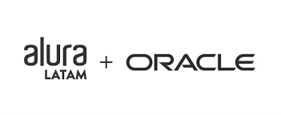

# Proyecto Amigo Secreto - Oracle One
<!-- Tabla para centrar el título con imágenes a los lados -->
<table style="width:100%; border:0; table-layout:fixed;">
  <tr>
    <!-- Imagen izquierda -->
    <td style="width:10%; text-align:center; vertical-align:middle;">
      
    </td>
    <!-- Título centrado -->
    <td style="width:80%; text-align:center; vertical-align:middle;">
      <h1 style="margin:0;">Título Centrando con Imágenes</h1>
    </td>
    <!-- Imagen derecha -->
    <td style="width:10%; text-align:center; vertical-align:middle;">
      
    </td>
  </tr>
</table>
