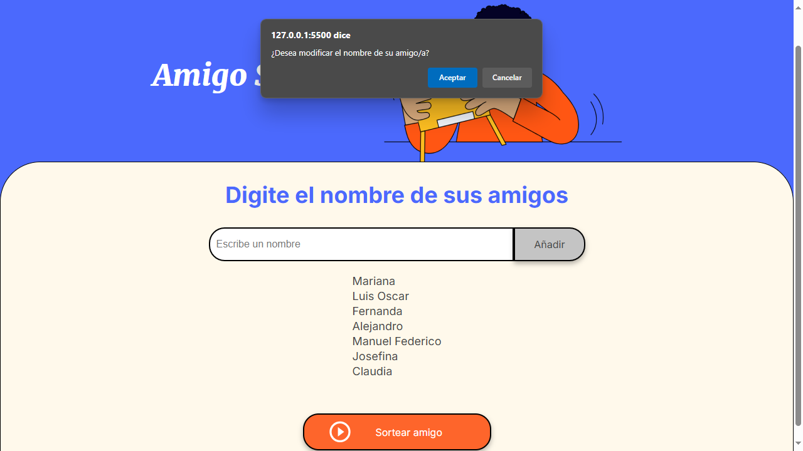

# Proyecto Amigo Secreto - Oracle One 

## Descripción

El presente proyecto tiene por finalidad poner en práctica los conocimientos adquiridos en el curso de lógica de programación brindado por parte del equipo de Alura Latam en conjunto con Oracle en su proyecto de Oracle One Education. La idea del mismo es emplear una simple página web, la cual está construido con HTML y CSS, y se debe ingresar un listado de nombres de personas, las cuales son amigos del usuario. Esa colección de nombre luego aparecen en una lista y al presionar un botón se elije de forma azarosa cuál es ese amigo secreto.

## Funcionalidades

### Funcionalidad N.º 1: Mensaje de error cuando no hay amigos ingresados

Esta funcionalidad se caracteriza por el hecho de que si el usuario final presiona el botón de *Sortear amigo* sin haber agregado ningún nombre de alguno de sus amigos aparecerá un cuadro emergente informando lo siguiente: *No hay amigos para sortear. Por favor, agregue amigos en la lista.*

### Funcionalidad N.º 2: Mensaje de error asociado a nombres

Para esta funcionalidad, cuando el usuario final ingresa el nombre de cada uno de sus amigos en el input correspondiente, si digita caracteres que no son válidos, es decir aquellos que no se corresponden con el alfabeto latino u otro tipo de caracteres diacríticos, aparece un cuadro emergente indicando lo siguiente: *Por favor, inserte un nombre*. También dicho mensaje de error aparece cuando el usuario no ha ingresado ningún nombre y presiona la tecla **ENTER** o hace click en el botón **Añadir**.

### Funcionalidad N.º 3: Modificación de los nombres ingresados

Esta funcionalidad permite elegir mediante un click ese nombre que se desea modificar debido a un error de ingreso en alguno o algunos de sus caracteres. Una vez efectuado el click, sale un cuadro emergente con este mensaje: **¿Desea modificar el nombre de su amigo/a?**, tal como lo muestra la siguiente imagen:

Si el usuario hace click en la opción de **Aceptar**, el nombre elegido para la modificación pasa a tener sus caracteres correspondientes en color azul y a su derecha aparece el siguiente texto: **-> Modificar este nombre**. Otro cambio que sucede es que se cambia el título de la página que dice: **Digite el nombre de sus amigos** por el siguiente: **Ingrese el nombre modificado**. La imagen que se muestra a continuación, lo pone de manifiesto:

La imagen precedente muestra que una en el campo de ingreso de nombres, aparece ya cargado el nombre que se ha escogido para realizar la modificación. Si hay errores al momento de modificarlo, se pondrá en acción la funcionalidad N.º 2. Si el nombre ha sido modificado correctamente, vuelve a aparecer en la lista de amigos ya actualizado y con el mismo color de letra que tenía antes de ser modificado. También desaparece el mensaje indicador en letras rojas que decía que ese nombre se debe modificar y de igual forma regresa el título principal de la página **Digite el nombre de sus amigos**. Estas imágenes así lo muestran:

#### Al momento de actualizar el nombre de la lista

#### Una vez que ha sido actualizado el nombre

### Funcionalidad N.º 4: Mensaje de comprobación antes del sorteo

Previo a realizar el sorteo de nombres de la lista de amigos que fue ingresada, al momento de hacer click en el botón **Sortear nombre**, aparece un cuadro emergente donde pregunta lo siguiente: **¿La lista con los nombres de sus amigos está completa y con los nombres ingresados correctamente?**. En caso de presionar **Aceptar** es la única vez que verá ese cuadro de diálogo, y ya podrá ver ese amigo secreto que aparece en forma aleatoria, si vuelve a hacer click sobre el botón **Sortear nombre** aparecerá otro amigo de la lista que usted ya ingresó. Si por alguna razón puso en cancelar en respuesta a la pregunta del cuadro emergente, el usuario final puede seguir añadiendo nombres a la lista de amigos y modificar aquellos que considere necesarios de acuerdo a las funcionalidad anterior. Aquí vemos, en las siguientes imágenes como se logra con el cometido del juego del amigo secreto:

#### Ventana emergente para consultar si todos los datos son correctos y no falta ninguno previo al sorteo del amigo secreto

#### Salida correspondiente a la elección del amigo secreto
